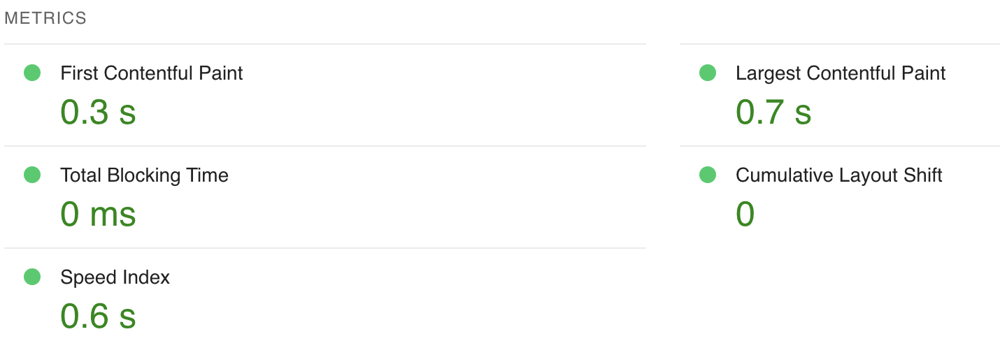
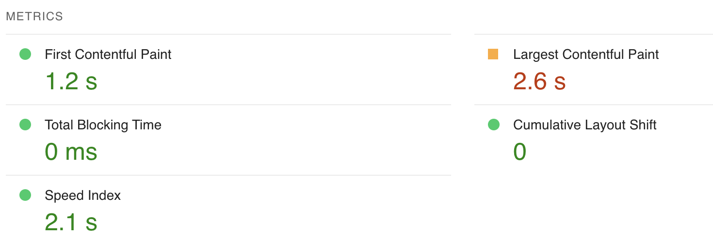

# 📸 Masonry Grid App

A high-performance **React 19** + **Vite 6** + **Zustand** application that fetches and displays images in a **virtualized masonry grid layout**.

The app supports **dynamic searching**, **infinite scrolling**, and **image details view**, all optimized for performance.

## 🌐 Live Demo

You can view the deployed application here:  
👉 **[Masonry Grid App Live Demo](https://arvan.github.io/masonry-grid-app/)**

The app is hosted on **GitHub Pages** and reflects the latest production build from the `main` branch via **GitHub Actions CI/CD**.

---

## 🚀 Features

✅ **Masonry Grid Layout** – Displays images dynamically in a structured format.  
✅ **Infinite Scrolling** – Seamless user experience without page reloads.  
✅ **Debounced Search** – Searches images dynamically while reducing API calls.  
✅ **Error Handling & Error Boundaries** – Ensures smooth user experience in case of failures.  
✅ **React Router 7** – Handles navigation efficiently.  
✅ **SEO Meta Tags** – Improves discoverability.  
✅ **Bundle Optimization** – Ensures small, fast-loading JavaScript chunks.  
✅ **Unit** – Uses `Vitest` and `React Testing Library`.  
✅ **GitHub Actions Deployment** – Automates testing and deployment to GitHub Pages.

---

## **🚀 Tech Stack**

| Technology            | Purpose                       |
| --------------------- | ----------------------------- |
| **React v19**         | Core framework                |
| **Vite**              | Fast build tooling            |
| **Zustand**           | State management              |
| **Styled-Components** | CSS-in-JS styling             |
| **React Router**      | Client-side navigation        |
| **Window Scroll API** | Virtualization & lazy loading |
| **Pexels API**        | Image source                  |

---

## 🛠️ **Installation & Setup**

### **1. Install Dependencies**

```sh
npm install
```

### **2. Add Environment Variables**

Create a `.env.local` file:

```
VITE_PEXELS_API_KEY=your-api-key
```

### **3. Run the Development Server**

`npm run dev`

Then, open **http://localhost:5173** in the browser.

### **4. Build for Production**

`npm run build`

### **5. Preview the Production Build Locally**

`npm run preview`

This runs the app **as it will be served in production**.

---

## 🏗 **Design & Performance Optimizations**

### **Virtualized Masonry Grid**

To handle **large datasets efficiently**, the app uses:

- **CSS Grid (`grid-auto-flow: dense;`)** for responsive layout.
- **Row-based virtualization** to **only render visible images**.
- **Corrected row height calculations** for **precise layout** using dynamic column width.
- **Lazy-loaded images** for reduced LCP (Largest Contentful Paint)

### **Optimized React Router 7 Integration**

- **Lazy-loaded routes** (`React.lazy()`) ensure minimal initial bundle size.
- **`basename` configured (`/masonry-grid-app/`)** for GitHub Pages compatibility.

### **Optimized Zustand Store for State Management**

- **Prevents duplicate API requests** using state tracking.
- **Persists search queries** for a smooth user experience.

### **Improved Bundle & Chunk Sizes**

- **Vite's `manualChunks`** ensures separate vendor bundles for `react-router`, `zustand`, and `styled-components`.
- **`rollupOptions` tree-shaking** aggressively removes unused dependencies.
- **Cache-busting filename hashing** for better performance.

### **Debounced Search for API Efficiency**

- **`useEffect` with `setTimeout`** to debounce API calls (500ms delay).
- **Ensures fewer network requests while keeping the UI responsive.**

### **Strong TypeScript Support**

- **Strict TypeScript settings (`strict: true`)** prevent runtime errors.
- **Typed API responses (`Photo` interface)** ensure safe data handling.
- **Full type safety in Zustand store, React Router, and components.**

### **Improved Caching & Deployment**

- **GitHub Actions handles deployment to GitHub Pages.**
- **Versioned asset filenames (`[name].[hash].js`)** prevent stale cache issues.
- **Custom `_headers` (attempted) → Fallback to hashed filenames for caching.**

---

## 🚀 **App Performance & Optimization Strategies**

Ensuring a **high-performance user experience** was a key priority in the development of this application. Utilized **Google Lighthouse** and **Chrome DevTools Performance Tab** to track and improve metrics such as **load time, rendering efficiency, and interactivity**.

---

### **📊 Lighthouse Performance Scores**

Ran **Lighthouse audits** on both **mobile and desktop**, and achieved the following scores:

| **Category**   | **Desktop Score** | **Mobile Score** |
| -------------- | ----------------- | ---------------- |
| Performance    | 🟢 **100**        | 🟢 **97**        |
| Accessibility  | 🟢 **100**        | 🟢 **100**       |
| Best Practices | 🟢 **100**        | 🟢 **100**       |
| SEO            | 🟢 **100**        | 🟢 **100**       |

🚀 **Final Lighthouse Scores:**  
**Desktop:**


**Mobile:**


### **🛠 Performance Optimization Techniques**

#### **1. Chrome Performance Tab Analysis**

Used the **Performance Profiler** in Chrome DevTools to:

- **Track JavaScript execution times** and reduce **long tasks (blocking UI threads).**
- **Measure render time** to optimize virtualized image loading.
- **Identify unnecessary re-renders** using the **React Profiler.**

🛠 **Key Fixes:**

- **Virtualized Masonry Grid** ensures only visible items are rendered, reducing DOM updates.
- **Debounced Search API Calls** (500ms delay) minimizes redundant network requests.
- **Code-Splitting with `manualChunks` in Vite** to reduce **initial bundle size**.

#### **2. Optimized Network Requests**

Using **Chrome’s Network Panel**, tracked:

- **API call times** (optimized with **Zustand’s state management**).
- **Lazy-loaded images** with placeholders to prevent **layout shifts (CLS issues).**
- **Caching & Asset Optimization** using:
  - **Versioned filenames (`[name].[hash].js`)** for efficient browser caching.
  - **GitHub Pages Cache Strategy** ensuring **HTML is always fresh, while assets are cached for a year**.

### **📌 Summary**

Using **Google Lighthouse & Chrome DevTools**:

- **Tracked app performance issues in real time.**
- **Optimized virtualized rendering & API calls.**
- **Ensured best practices for accessibility, SEO, and security.**
- **Achieved near-perfect Lighthouse scores.**

---

## 🎨 **Design Decisions & Technology Choices**

Throughout development, made several **technology choices** based on **performance, maintainability, and best practices**. Below is a summary of the key decisions:

### **1. Vite 6 vs. Webpack for Development & Build System**

✅ **Vite 6** was chosen over **Webpack** because:

- **Faster Development (HMR) 🚀** – Vite uses **native ES modules** for **instant hot module replacement (HMR)**, whereas Webpack rebuilds the entire bundle.
- **Smaller Bundles 📦** – Vite **automatically tree-shakes and removes dead code**, whereas Webpack often requires **manual optimization** via plugins.
- **Lightning-Fast Builds ⚡** – Vite pre-bundles dependencies using **esbuild**, which is **~10-100x faster** than Webpack's Babel-based bundling.
- **Better Code Splitting & Lazy Loading** – Vite **handles dynamic imports more efficiently** with **Rollup’s output optimizations**.
- **Simplified Configuration** – Webpack requires complex **`webpack.config.js`** and **Babel/ESLint integration**, while Vite works out-of-the-box.

### **2. Zustand for State Management**

✅ Chose **Zustand** over Redux and Context API because:

- **Minimal boilerplate** compared to Redux.
- **Better performance** than Context API, which can cause unnecessary re-renders.
- **Built-in asynchronous state management** for API calls.

### **3. React Router 7 for Navigation**

✅ **React Router 7** was used instead of Next.js routing because:

- The project does **not require SSR (Server-Side Rendering)**.
- **More flexibility for client-side routing**.
- **Tree-shaking optimizations** (only `BrowserRouter` is included).

### **4. Virtualized Masonry Grid for Performance**

✅ A **scroll position row-based virtualization approach** was chosen because:

- **Only visible images are rendered**, reducing memory consumption.
- **Precomputed image positions** prevent layout shifts.
- **CSS Grid (`grid-auto-flow: dense`)** ensures responsive layout.

### **5. Debounced Search for API Efficiency**

✅ A **500ms debounce mechanism** was used instead of immediate API calls:

- **Reduces excessive network requests** while typing.
- **Improves user experience** with real-time search feedback.

### **6. Bundle & Chunk Optimization**

✅ **Manual chunking in Vite** was implemented to reduce initial load times:

- **Splitting large dependencies (`react-router`, `zustand`, etc.)** into separate files.
- **Vendor files (`vendor.js`) cached for a year** to optimize repeat visits.
- **Versioned filenames (`[name].[hash].js`)** prevent stale cache issues.

### **7. TypeScript for Strong Typing**

✅ **Strict TypeScript settings** were enabled to:

- **Prevent runtime errors** before they happen.
- **Ensure API responses are properly typed**.
- **Improve developer experience with auto-completion and type safety**.

---

These design choices **optimize performance, maintainability, and scalability** while ensuring a **smooth user experience**. 🚀

## 🔍 **Testing Strategy**

### **1. Unit Tests (`Vitest` + `React Testing Library`)**

- **Component rendering (SearchInput, MasonryGrid)**
- **Zustand store API request handling**
- **React Router navigation validation**

### **2. GitHub Actions CI Pipeline**

- **Ensures TypeScript correctness before building**
- **Runs unit tests before deployment**

To run tests manually:

`npm test`

---

## 🌍 **Deployment**

This project is deployed using **GitHub Actions** and served via **GitHub Pages**.

### **How to Deploy Manually**

1.  **Run the production build**:

    `npm run build`

2.  **Deploy using GitHub Actions**:

    `git push origin main`

    GitHub Actions will **automatically build and deploy**.

---

## 📜 **License**

This project is licensed under the **MIT License**.

---
